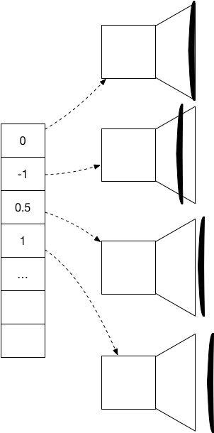
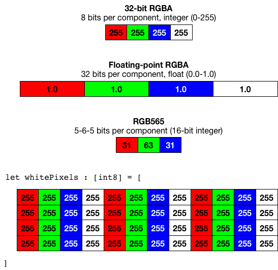
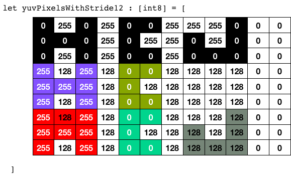
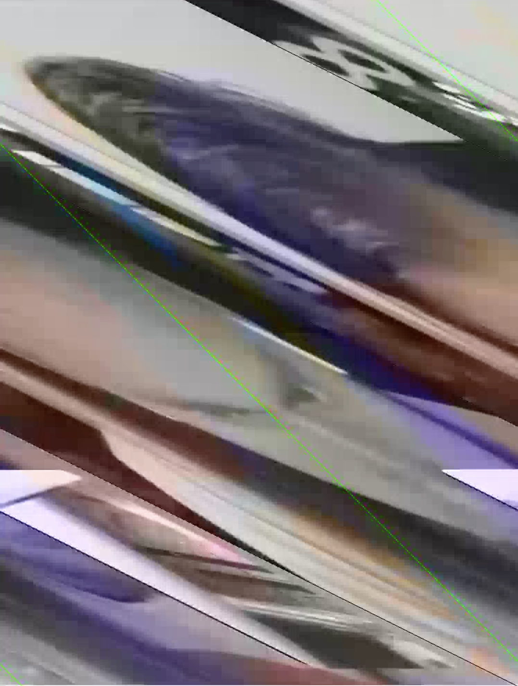

theme: Letters from Sweden, 2
# [Fit] LBMediaToolkit
## [Fit] Diving into Apple low level
## [Fit] media frameworks
## PART 1
### @nevyn, @lookback
#### Cocoaheads #87, 2018-01-09

--- 

# [Fit] @nevyn

---


---

# Recording camera: High-level approach

--- 

```swift
import AVFoundation

// Start configuring the capture session
var captureSession  = AVCaptureSession()
captureSession.beginConfiguration()

// Input: Recording the back facing camera
let device = AVCaptureDevice.devices().first { $0.position == .back }
let input = try! AVCaptureDeviceInput(device: device!)
captureSession.addInput(input)

// Output: Writing to a file on disk
let output = AVCaptureMovieFileOutput()
captureSession.addOutput(output)

// Stop configuring and apply
captureSession.commitConfiguration()

// Let's go!
captureSession.startRunning()
output.startRecording(to: filePath, recordingDelegate: self)

```

---

```swift

captureSession.sessionPreset = .high

extension AVCaptureSession.Preset {
    public static let photo: AVCaptureSession.Preset
    public static let high: AVCaptureSession.Preset
    public static let medium: AVCaptureSession.Preset
    public static let low: AVCaptureSession.Preset
    public static let cif352x288: AVCaptureSession.Preset
    public static let vga640x480: AVCaptureSession.Preset
    public static let hd1280x720: AVCaptureSession.Preset
    public static let hd1920x1080: AVCaptureSession.Preset
    public static let hd4K3840x2160: AVCaptureSession.Preset
    public static let iFrame960x540: AVCaptureSession.Preset
    public static let iFrame1280x720: AVCaptureSession.Preset
}
```

---

# Recording camera: Mid-level approach

---

```swift

// Create and start configuring
captureSession.beginConfiguration()

// Setup input
let device = AVCaptureDevice.devices().first { $0.position == .back }
let input = try! AVCaptureDeviceInput(device: device!)
captureSession.addInput(input)

// Setup output: just get the data
output = AVCaptureVideoDataOutput()
output.videoSettings = [
  kCVPixelBufferPixelFormatTypeKey as String: kCVPixelFormatType_32BGRA
]
output.setSampleBufferDelegate(self, queue: workQueue)
captureSession.addOutput(output)

// Save settings!
captureSession.commitConfiguration()
```

---

```swift
// Create a file writer
writer = try! AVAssetWriter(url: filePath, fileType: .m4v)
// An adapter is needed to append video data to it
writerInput = AVAssetWriterInput(mediaType: .video, outputSettings: [
  AVVideoWidthKey: 640,
  AVVideoHeightKey: 480,
])
writer.add(writerInput)

// Kick off!
writer.startWriting()
writer.startSession(atSourceTime: CMTimeMake(0, 90000))
captureSession.startRunning()
          
func captureOutput(
    captureOutput: AVCaptureOutput!,
    didOutputSampleBuffer sampleBuffer: CMSampleBuffer!,
    fromConnection connection: AVCaptureConnection!
) {
    CMSampleBufferSetTimings(...)........
    writerInput.append(sampleBuffer)
}

```

---

# Recording camera: Low-level approach

---

Hold your horses...

---

# [Fit] Core Media

---

# CMSampleBuffer
[.autoscale: true]

Holds one piece of audio, video or muxed data.

* CMBlockBuffer
* CMFormatDescription
* Timing information
    * Duration
    * Presentation time
    * Decode time
* Attachments

---

# CMTime

* `CMTimeAdd`, `CMTimeGetSeconds`, ...
* 2550 value / 1000 dividend = 2.55 seconds
* Audio: Timescale = sample rate (e g 44100)
* Video: Usually 90 000 (MPEG standard)

---

# [Fit] Core Audio

---



---

* Sample rates. 44100 is nice.
* Mono or stereo.
* Chunked or interleaved. (recommend interleaved)
* Floating point or integer. (recommend float)
* 8, 16 or 32 bit; signed or unsigned. (16 bit signed is nice)
* Non-audio bits...
* So on, so forth...

---

* CMAudioFormatDescription
* AudioStreamBasicDescription
* ASBD

---

```objc
double durationInSeconds = 0.1;
int sampleRate = 44100;
int nFrames = sampleRate*durationInSeconds;
// 16 bit audio per channel. 1 frame = one L sample and one R sample.
int bytesPerFrame = 2 * numChannels; 
int blockSize = nFrames*bytesPerFrame;
AudioStreamBasicDescription asbd = (AudioStreamBasicDescription){
    .mSampleRate = sampleRate,
    .mFormatID = kAudioFormatLinearPCM,
    .mFormatFlags = kLinearPCMFormatFlagIsSignedInteger,
    .mBytesPerPacket = bytesPerFrame,
    .mFramesPerPacket = 1,
    .mBytesPerFrame = bytesPerFrame,
    .mChannelsPerFrame = numChannels,
    .mBitsPerChannel = 16,
    .mReserved = 0,
};
```

---

```objc
AudioStreamBasicDescription asbd = (AudioStreamBasicDescription){
    .mSampleRate =  44100,
    .mFormatID = kAudioFormatMPEG4AAC,
    .mFormatFlags = 0,
    .mBytesPerPacket = 0,
    .mFramesPerPacket = 1024,
    .mBytesPerFrame = 0,
    .mChannelsPerFrame = 1,
    .mBitsPerChannel = 0,
};
```

---

# [Fit] AVAudioEngine

---

# [Fit] AudioConverter

---

```objc
- (void)_encoderThread
{
    GFLog(GFDebug, @"AAC encoder thread is starting");
    [NSThread currentThread].name = [NSString stringWithFormat:@"io.lookback.aac.encoder.%p", self];
	while(_running) {
		@autoreleasepool {
			// Make quarter-second buffers.
			UInt32 bufferSize = (_outputBitrate/8) * 0.25;
			NSMutableData *outAudioBuffer = [NSMutableData dataWithLength:bufferSize];
			AudioBufferList outAudioBufferList;
			outAudioBufferList.mNumberBuffers = 1;
			outAudioBufferList.mBuffers[0].mNumberChannels = _toFormat.mChannelsPerFrame;
			outAudioBufferList.mBuffers[0].mDataByteSize = (UInt32)bufferSize;
			outAudioBufferList.mBuffers[0].mData = [outAudioBuffer mutableBytes];

            // figure out how many packets could fit in a quarter-second buffer
            UInt32 ioOutputDataPacketSize = 1;
            if(_toFormat.mFormatID != kAudioFormatMPEG4AAC) {
                UInt32 outputSizePerPacket = _toFormat.mBytesPerPacket;
                UInt32 size = sizeof(outputSizePerPacket);
                AudioConverterGetProperty(_converter, kAudioConverterPropertyMaximumOutputPacketSize, &size, &outputSizePerPacket);
                ioOutputDataPacketSize = bufferSize / outputSizePerPacket;
            }
            
			EncoderDebug(@"Encoder is doing an iteration of %u output bytes (%u packets)", (unsigned int)bufferSize, (unsigned int)ioOutputDataPacketSize);
			
			_currentPresentationTime = kCMTimeInvalid;
			const OSStatus conversionResult = AudioConverterFillComplexBuffer(_converter, FillBufferTrampoline, (__bridge void*)self, &ioOutputDataPacketSize, &outAudioBufferList, NULL);
			[_packetsToDelete removeAllObjects];
		
			if(conversionResult != noErr) {
				NSLog(@"Failed to convert a buffer: %d", (int)conversionResult);
				continue;
			}
			if(outAudioBufferList.mBuffers[0].mDataByteSize == 0) {
				NSLog(@"No data generated, skipping buffer");
				continue;
			}

			UInt32 cookieSize = 0;
			AudioConverterGetPropertyInfo(_converter, kAudioConverterCompressionMagicCookie, &cookieSize, NULL);
			char cookie[cookieSize];
			AudioConverterGetProperty(_converter, kAudioConverterCompressionMagicCookie, &cookieSize, cookie);
			
			CMAudioFormatDescriptionRef audioFormat;
			const OSStatus formatCreationError = CMAudioFormatDescriptionCreate(
				kCFAllocatorDefault,
				&_toFormat,
				0, NULL, // layout
				cookieSize, cookie, // cookie
				NULL, // extensions
				&audioFormat);
			if(formatCreationError != noErr) {
				NSLog(@"Failed to convert a buffer because format creation failed: %d", (int)formatCreationError);
				continue;
			}
			CFAutorelease(audioFormat);
			CMSampleTimingInfo timing = {
				.duration = CMTimeMake(_toFormat.mFramesPerPacket, _toFormat.mSampleRate),
				.presentationTimeStamp = _currentPresentationTime,
				.decodeTimeStamp = _currentPresentationTime
			};
			
			size_t sampleSize =
				outAudioBufferList.mBuffers[0].mDataByteSize / ioOutputDataPacketSize;
			
			CMSampleBufferRef outSampleBuffer;
			OSStatus sampleBufferCreationStatus = CMSampleBufferCreate(
				NULL, // allocator
				NULL, // dataBuffer
				YES, // dataReady
				NULL, //makeDataReadyCallback
				NULL, //refcon for above
				audioFormat, // formatDescription
				ioOutputDataPacketSize,// numSamples
				1, // timingInfoCount
				&timing, // timingInfoArray
				1, // numSampleSizeEntries
				&sampleSize, // sampleSizeArray
				&outSampleBuffer
			);
			if(sampleBufferCreationStatus != noErr) {
				NSLog(@"Failed to create sample buffer: %d", (int)sampleBufferCreationStatus);
				continue;
			}
			
			OSStatus setDataBufferError = CMSampleBufferSetDataBufferFromAudioBufferList(outSampleBuffer, NULL, NULL, 0, &outAudioBufferList);
			if(setDataBufferError != noErr) {
				NSLog(@"Failed to set data buffer: %d", (int)setDataBufferError);
				continue;
			}
			
            if(_primingInfo.leadingFrames == 0) {
                UInt32 primingInfoSize = sizeof(_primingInfo);
                AudioConverterGetProperty(_converter, kAudioConverterPrimeInfo, &primingInfoSize, &_primingInfo);
            }
            
			EncoderDebug(@"Giving delegate %d output bytes of aac", outAudioBufferList.mBuffers[0].mDataByteSize);
			[self.delegate encoder:self encodedSampleBuffer:outSampleBuffer trimDurationAtStart:_primingInfo.leadingFrames];
			CFRelease(outSampleBuffer);
		}
	}
    GFLog(GFDebug, @"AAC encoder thread is exiting");
    [_stopCompletionSource completeWithValue:nil];
}
```

---

```objc
- (OSStatus)fillBuffer:(AudioBufferList*)ioData dataPacketCount:(UInt32*)ioNumberDataPackets packetDescription:(AudioStreamPacketDescription**)outDataPacketDescription
{
	UInt32 requestedByteCount = *ioNumberDataPackets * _fromFormat.mBytesPerPacket;
	UInt32 bytesWrittenSoFar = 0;
	EncoderDebug(@"Got a request for %d input bytes", requestedByteCount);
	[_queueSemaphore lock];
	
	// The loop ensures we test predicates properly after the semaphore has signalled
	while (requestedByteCount - bytesWrittenSoFar > 0) {
		if(!_running) break;
		
		if(_queuedPackets.count == 0) {
			EncoderDebug(@"Waiting for data");
			[_queueSemaphore wait];
			continue;
		}
		
		EncoderDebug(@"Data is now available, %ld packets queued", (unsigned long)_queuedPackets.count);
		
		// Ok, we got data! Just fill in data from a single queued packet.
		LBAACEncoderPacket *first = [_queuedPackets firstObject];
		if(CMTIME_IS_INVALID(_currentPresentationTime)) {
			_currentPresentationTime = CMSampleBufferGetPresentationTimeStamp(first.sampleBuffer);
			// If we're starting from inside this buffer, advance the presentation time to match.
			if(first.processedByteCount > 0) {
				GFLog(GFTrace, @"Bumping presentation time due to fetching in the middle of a buffer");
				_currentPresentationTime = CMTimeAdd(_currentPresentationTime, CMTimeMake(first.processedByteCount/_fromFormat.mBytesPerPacket, _fromFormat.mSampleRate));
			}
		}
		
		UInt32 bytesToWrite = MIN(requestedByteCount - bytesWrittenSoFar, first.remainingBytes);
		for(int i = 0; i < ioData->mNumberBuffers; i++) {
			ioData->mBuffers[i].mData = first.bufferList->mBuffers[i].mData + first.processedByteCount;
			ioData->mBuffers[i].mDataByteSize = bytesToWrite;
			ioData->mBuffers[i].mNumberChannels = first.bufferList->mBuffers[i].mNumberChannels;
		}
		first.processedByteCount += bytesToWrite;
		bytesWrittenSoFar += bytesToWrite;
		
		if(first.remainingBytes == 0) {
			[_packetsToDelete addObject:first];
			[_queuedPackets removeObjectAtIndex:0];
		}
		break;
	}
	
	[_queueSemaphore unlock];
	
	// if running is false, this will be 0, indicating EndOfStream
	*ioNumberDataPackets = bytesWrittenSoFar / _fromFormat.mBytesPerPacket;
	EncoderDebug(@"Fulfilled request with %d bytes", bytesWrittenSoFar);

    return noErr;
}
```

---

# Get the source

https://github.com/nevyn/LBMediaToolkit

---

# [Fit] CoreVideo

---



---


(Image credit: [Simon A. Eugster, wikipedia](https://en.wikipedia.org/wiki/YCbCr#/media/File:YCbCr-CbCr_Scaled_Y50.png))

---

YUV,  Y'CbCr,  Y'PbPr, 422, 420, kCVPixelFormatType_420YpCbCr8BiPlanarVideoRange


---



---



---

# CVPixelBuffer

* "Same" as CVImageBuffer
* Backing store for CGBitmapContext

---

# CVPixelBufferPool

```objc
OSStatus poolErr = CVPixelBufferPoolCreate(NULL,
	NULL, // pool attrs
	(__bridge CFDictionaryRef)(@{
		(id)kCVPixelBufferPixelFormatTypeKey: @(...),
		(id)kCVPixelBufferWidthKey: @(layerSize.width),
		(id)kCVPixelBufferHeightKey: @(layerSize.height),
	}),
	&_pixelBufferPool
);

//... later

CVPixelBufferPoolCreatePixelBuffer(NULL, _pixelBufferPool, buffer);

```

---

# Pixels into CMSampleBuffer

```objc
CMFormatDescriptionRef formatDescription;
CMSampleBufferRef sampleBuffer;

CMVideoFormatDescriptionCreateForImageBuffer(NULL, pixelBuffer, &formatDescription);

CMSampleBufferCreateForImageBuffer(
	NULL,
	pixelBuffer,
	true, NULL, NULL, // data is ready
	formatDescription,
	&timing,
	&sampleBuffer
);
```

---

# Muxing

---

# AVComposition

---

# VideoToolkit

---

# LBIFFSerializer

---

# LBSampleBufferFileSerialization

---

# Memory and thread management

---

# Code and presentation notes

https://github.com/nevyn/LBMediaToolkit

---

# [fit] Thank you!
## @nevyn