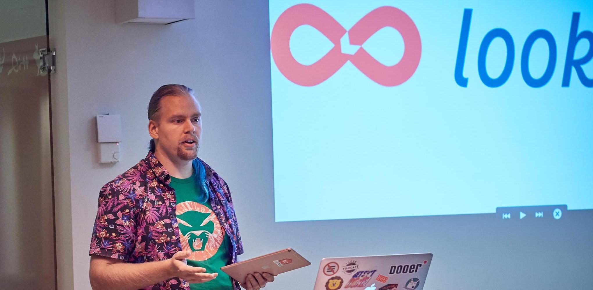

# LBMediaToolkit

A toolkit of useful AVFoundation companion classes, and a meetup presentation
teaching the fundamentals of audio/video programming with Apple frameworks
(CoreMedia, CoreAudio, CoreVideo, AVFoundation and so on).

* [Presentation video](https://www.facebook.com/cocoaheadssthlm/videos/1918413685140957/)
  (my presentation starts at 1h21m into the video)
* [Presentation slides](Presentation/AVMediaToolkit%20Cocoaheads.pdf)
* [Presentation notes](Presentation/AVMediaToolkit%20presentation%20notes.rtf)

# Available classes

## LBAudioConverter

Wraps AudioToolkit's AudioConverter class with a sane and asynchronous
Objective-C/Swift API.